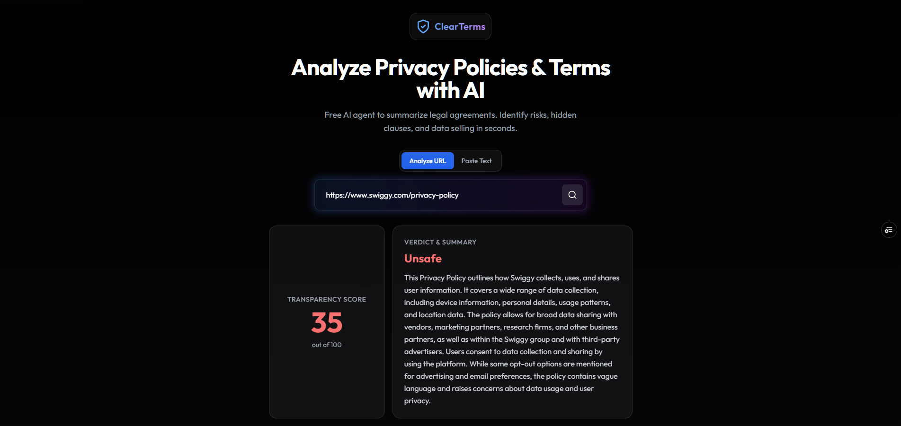

# 🛡️ ClearTerms - AI Privacy Policy Agent

[](https://clear-terms.vercel.app/)
[](LICENSE)
[](https://ai.pydantic.dev/)

**ClearTerms** is a full-stack Generative AI application that protects you from predatory legal agreements. It uses multi-model AI agents (Gemini, GPT-4o, Llama 3) to scan Privacy Policies and Terms of Service instantly, highlighting red flags and summarizing your rights in plain English.



---

## 🚀 Why Choose ClearTerms?

In a digital world where "I Agree" is the biggest lie, ClearTerms stands as your personal legal defense.

*   **🔍 Deep Legal Analysis, Not Just Keywords**: unlike simple keyword CTRL+F tools, our **Pydantic AI** agent understands context. It can distinguish between "we sell your data" and "we transfer data to service providers".
*   **🤖 Multi-Model Failsafe Intelligence**: Built with a robust fallback system. If one AI model is busy, ClearTerms automatically switches providers (Gemini → GPT → Llama), ensuring **100% uptime** and reliability.
*   **✨ Premium User Experience**: Legal tools don't have to be boring. Enjoy a stunning, mobile-responsive **Glassmorphism UI** that makes reading contracts as easy as browsing social media.
*   **🛡️ Privacy First**: We analyze policies without storing your personal data. Your privacy is our priority while we check theirs.

---

## ✨ Features
-   **AI Risk Detection**: Instantly identifies "High Severity" risks like Data Selling, IP Ownership, and Forced Arbitration.
-   **Transparency Score**: Assigns a simple 0-100 score to every policy.
-   **Smart Fallback System**: Automatically rotates between Google Gemini 2.0, GPT-4o-mini, and Llama 3.1 to guarantee results.
-   **Anti-Bot Scraping**: Uses a hybrid scraper (Jina Reader + Headless Fallback) to read policies even from difficult sites like Zomato.
-   **Modern Tech Stack**: Built with Next.js 14, FastAPI (Python), and Tailwind CSS.

## 🛠️ Tech Stack
-   **Frontend**: Next.js 14, TypeScript, Tailwind CSS, Framer Motion, Lucide React.
-   **Backend**: Python 3.9+, Pydantic AI, FastAPI (Serverless), Trafilatura.
-   **AI Infrastructure**: OpenRouter (Unified API for Top LLMs).
-   **Deployment**: Vercel (Frontend + Python Serverless Functions).

## 📂 Project Structure
```bash
/
├── api/                # Python Serverless Functions (FastAPI entry)
├── backend/            # Core AI Logic & Agent Definitions
│   └── agent.py        # Pydantic AI Agent & Multi-Model Logic
├── frontend/           # Next.js Application
│   ├── app/            # App Router Pages
│   └── components/     # UI Components
├── requirements.txt    # Python Dependencies
└── vercel.json         # Vercel Build Config
```

## ⚡ Local Development
1.  **Clone the repo**:
    ```bash
    git clone https://github.com/yourusername/clearterms.git
    ```
2.  **Install Python Backend**:
    ```bash
    pip install -r requirements.txt
    ```
3.  **Install Frontend**:
    ```bash
    cd frontend && npm install
    ```
4.  **Setup Keys**: Create a `.env` file and add your `OPENROUTER_API_KEY`.
5.  **Run Locally**:
    *   Backend: `uvicorn api.index:app --reload`
    *   Frontend: `npm run dev`

## ☁️ Deployment
This project is optimized for [Vercel](https://vercel.com).
1.  Push to GitHub.
2.  Import project in Vercel.
3.  Add `OPENROUTER_API_KEY` in Environment Variables.
4.  Deploy!
